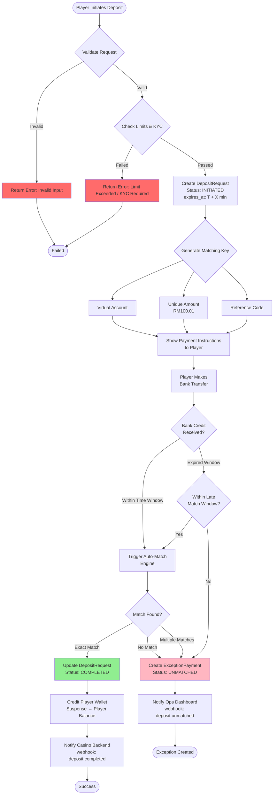

# Deposit Request Flow (Normal Path)

## Overview
This flow handles the standard deposit request from player initiation to successful completion.

## Mermaid Diagram



## Exception Handling

### 1. **Input Validation Errors**
**Exception:** Invalid amount, missing playerId, unsupported currency
- **Detection:** Pre-validation before request creation
- **Handling:**
  - Return HTTP 400 with detailed error message
  - Log validation failure with playerId and timestamp
  - No database record created
- **Recovery:** Player corrects input and resubmits

### 2. **Limit & KYC Failures**
**Exception:** Exceeds daily/monthly limits, KYC tier insufficient
- **Detection:** Business rule validation
- **Handling:**
  - Return HTTP 403 with reason (e.g., "Daily limit exceeded")
  - Log event for fraud monitoring
  - Suggest KYC upgrade if applicable
- **Recovery:** Player waits for limit reset or completes KYC

### 3. **Request Expiry (UI Timeout)**
**Exception:** DepositRequest expires before payment made
- **Detection:** Scheduled job checks expires_at timestamp
- **Handling:**
  - Update status: INITIATED → EXPIRED_UI
  - DO NOT reject late payments (use late window)
  - Player sees "Request expired" in UI
- **Recovery:** Create new request or wait for late match

### 4. **Database/System Errors**
**Exception:** Failed to create DepositRequest record
- **Detection:** Database exception during creation
- **Handling:**
  - Rollback transaction
  - Return HTTP 500 with generic error
  - Alert DevOps team (critical)
  - Log full stack trace
- **Recovery:** Player retries after system recovery

## State Transitions

```
INITIATED → EXPIRED_UI (timeout)
INITIATED → COMPLETED (successful match)
EXPIRED_UI → COMPLETED (late match within window)
```

## Key Validation Rules

1. **Amount:**
   - Min: RM 10.00
   - Max: Based on player KYC tier
   - Format: 2 decimal places

2. **PlayerId:**
   - Must exist in system
   - Must be active (not suspended/banned)

3. **Operator:**
   - Must be licensed
   - Must have active bank account configuration

4. **Currency:**
   - Must match operator's supported currencies

## Timing Parameters

- **Expiry Window:** 15-30 minutes (configurable)
- **Late Match Window:** 24-72 hours after expiry
- **Grace Period:** 5 minutes before marking as EXPIRED_UI

## Notification Events

1. **deposit.request.created** → Casino Backend
2. **deposit.completed** → Casino Backend + Player
3. **deposit.expired** → Player only
4. **deposit.unmatched** → Ops Dashboard
