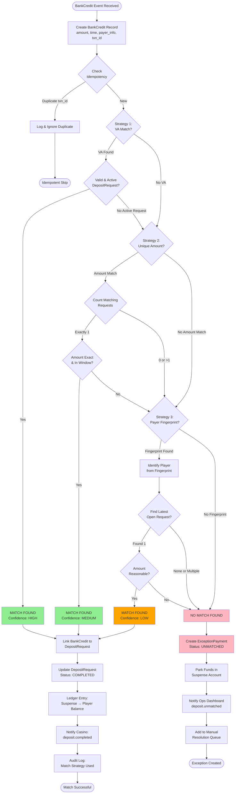
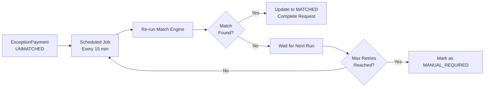

# Auto-Match Engine Flow

## Overview
The matching engine automatically links incoming bank credits to pending deposit requests using multiple matching strategies.

## Mermaid Diagram



## Matching Strategies (Priority Order)

### Strategy 1: Virtual Account Match (Highest Confidence)
**Logic:** Direct account mapping
```
if (bankCredit.destination_account == depositRequest.virtual_account) {
  match = depositRequest
  confidence = HIGH
}
```

**Exceptions:**
- **VA exists but no active request:** Create exception (possible fraud/late payment)
- **VA not found in system:** Create exception (configuration error)

**Handling:**
- Log warning if VA has no active request
- Still create exception for manual review
- Alert if VA hasn't been used in 90 days

---

### Strategy 2: Unique Amount Match (Medium Confidence)
**Logic:** Exact amount matching with cent-tagging
```
matches = depositRequests.where(
  payable_amount == bankCredit.amount &&
  status IN (INITIATED, EXPIRED_UI) &&
  created_at >= NOW() - late_match_window
)

if (matches.count == 1) {
  match = matches.first
  confidence = MEDIUM
}
```

**Exceptions:**
- **Multiple matches (RM100.01):** Create exception - ambiguous
- **No matches:** Proceed to Strategy 3
- **Amount close but not exact (RM100.00 vs RM100.01):** Create exception

**Handling:**
- Require exact decimal match (no rounding)
- If multiple, rank by timestamp proximity
- Store all candidates in exception for manual review

---

### Strategy 3: Payer Fingerprint Match (Low Confidence)
**Logic:** Bank account/name recognition
```
player = identifyPlayer(bankCredit.payer_account_number, bankCredit.payer_name)

if (player) {
  latestRequest = depositRequests.where(
    player_id == player.id &&
    status IN (INITIATED, EXPIRED_UI) &&
    created_at >= NOW() - late_match_window
  ).order_by(created_at DESC).first

  if (latestRequest && amountReasonable(bankCredit.amount, latestRequest.amount)) {
    match = latestRequest
    confidence = LOW
  }
}
```

**Exceptions:**
- **Player has multiple open requests:** Create exception
- **Amount variance > 10%:** Create exception
- **Payer fingerprint matches multiple players:** Create exception (fraud alert)

**Handling:**
- Require amount within ±10% tolerance
- Log low-confidence match for review
- Send notification to ops even if auto-matched

---

## Exception Handling

### 1. **Duplicate Bank Credit (Idempotency)**
**Exception:** Same transaction_id received multiple times
- **Detection:** Check BankCredit.transaction_id uniqueness
- **Handling:**
  - Log duplicate with timestamp
  - Return success (already processed)
  - No exception created
- **Recovery:** Automatic (idempotent)

### 2. **Ambiguous Match (Multiple Candidates)**
**Exception:** Same amount, multiple pending requests
- **Detection:** Strategy 2 returns count > 1
- **Handling:**
  - Create ExceptionPayment with all candidate IDs
  - Set priority: HIGH (needs manual resolution)
  - Show candidates in ops dashboard
- **Recovery:** Manual selection by ops staff

### 3. **Amount Mismatch (Close but Not Exact)**
**Exception:** Player sent RM100.00 instead of RM100.01
- **Detection:** No exact match found in Strategy 2
- **Handling:**
  - Create ExceptionPayment
  - Store fuzzy matches (within ±RM1) as suggestions
  - Auto-retry if VA or fingerprint available
- **Recovery:** Manual match or auto-retry with Strategy 3

### 4. **Late Payment (Beyond Expiry)**
**Exception:** Payment arrives after DepositRequest expired
- **Detection:** BankCredit.timestamp > DepositRequest.expires_at
- **Handling:**
  - Check late_match_window (24-72h)
  - If within window: proceed with match
  - If beyond: create ExceptionPayment
  - Mark as COMPLETED_LATE if matched
- **Recovery:** Auto-match if within window, else manual

### 5. **Unrecognized Payer**
**Exception:** No fingerprint match in system
- **Detection:** Strategy 3 fails to identify player
- **Handling:**
  - Create ExceptionPayment
  - Store raw payer info for ops review
  - Suggest creating new player mapping
- **Recovery:** Manual review, possibly new player account

### 6. **Overpayment / Underpayment**
**Exception:** Amount significantly different from request
- **Detection:** |bankCredit.amount - depositRequest.amount| > tolerance
- **Handling:**
  - Create ExceptionPayment
  - Flag as AMOUNT_VARIANCE
  - Require manual approval for partial credit
- **Recovery:** Manual decision (refund vs partial credit)

---

## Auto-Retry Mechanism



**Configuration:**
- Retry interval: 15 minutes
- Max retries: 24 (6 hours)
- After max retries: Escalate to manual queue

---

## Confidence Levels & Actions

| Confidence | Strategy | Auto-Complete? | Notification |
|------------|----------|----------------|--------------|
| HIGH       | VA Match | Yes            | Casino only  |
| MEDIUM     | Unique Amount | Yes         | Casino + Log |
| LOW        | Payer Fingerprint | Yes* | Casino + Ops Alert |
| NONE       | No Match | No             | Ops Dashboard |

*Low confidence matches may require operator configuration flag

---

## Audit Trail

Every match attempt logs:
- BankCredit ID
- Strategies attempted
- Match result (success/fail)
- Confidence level
- Processing time
- System timestamp

Format:
```json
{
  "bank_credit_id": "BC123456",
  "strategies_tried": ["VA", "UNIQUE_AMOUNT"],
  "match_result": "SUCCESS",
  "matched_request_id": "DR789012",
  "confidence": "MEDIUM",
  "strategy_used": "UNIQUE_AMOUNT",
  "processing_time_ms": 45,
  "timestamp": "2026-02-01T10:30:00Z"
}
```


flowchart TD
    Start([Player Initiates Deposit]) --> ValidateInput{Validate Request}
    ValidateInput -->|"Invalid"| E1[Return Error: Invalid Input]
    ValidateInput -->|"Valid"| CheckLimits{Check Limits & KYC}

    CheckLimits -->|"Failed"| E2[Return Error: Limit Exceeded / KYC Required]
    CheckLimits -->|"Passed"| CreateRequest[Create DepositRequest<br/>Status: INITIATED<br/>expires_at: T + X min]

    CreateRequest --> GenerateKey{Generate Matching Key}
    GenerateKey --> KeyOption1[Virtual Account]
    GenerateKey --> KeyOption2[Unique Amount<br/>RM100.01]
    GenerateKey --> KeyOption3[Reference Code]

    KeyOption1 --> ShowInstructions[Show Payment Instructions<br/>to Player]
    KeyOption2 --> ShowInstructions
    KeyOption3 --> ShowInstructions

    ShowInstructions --> PlayerTransfer[Player Makes<br/>Bank Transfer]

    PlayerTransfer --> BankCreditReceived{Bank Credit<br/>Received?}

    BankCreditReceived -->|"Within Time Window"| AutoMatch[Trigger Auto-Match<br/>Engine]
    BankCreditReceived -->|"Expired Window"| CheckLateWindow{Within Late<br/>Match Window?}

    CheckLateWindow -->|"Yes"| AutoMatch
    CheckLateWindow -->|"No"| CreateException[Create ExceptionPayment<br/>Status: UNMATCHED]

    AutoMatch --> MatchResult{Match Found?}

    MatchResult -->|"Exact Match"| CompleteDeposit[Update DepositRequest<br/>Status: COMPLETED]
    MatchResult -->|"No Match"| CreateException
    MatchResult -->|"Multiple Matches"| CreateException

    CompleteDeposit --> CreditWallet[Credit Player Wallet<br/>Suspense → Player Balance]
    CreditWallet --> NotifySuccess[Notify Casino Backend<br/>webhook: deposit.completed]
    NotifySuccess --> End1([Success])

    CreateException --> NotifyException[Notify Ops Dashboard<br/>webhook: deposit.unmatched]
    NotifyException --> End2([Exception Created])

    E1 --> End3([Failed])
    E2 --> End3

    style CompleteDeposit fill:#90EE90
    style CreateException fill:#FFB6C1
    style E1 fill:#FF6B6B
    style E2 fill:#FF6B6B