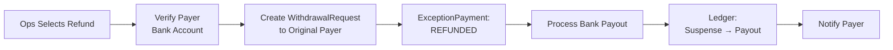

# Deposit Exception Resolution Flow

## Overview
Handles unmatched deposits through automated retry and manual resolution processes.

## Mermaid Diagram

```mermaid
flowchart TD
    Start([ExceptionPayment Created<br/>Status: UNMATCHED]) --> CheckMode{Resolution<br/>Mode?}

    %% Auto-Resolve Branch
    CheckMode -->|AUTO Mode| AutoRetry[Scheduled Job<br/>Every X Minutes]
    AutoRetry --> RerunMatch[Re-run Match Engine<br/>with Latest Data]
    RerunMatch --> AutoResult{Match<br/>Found?}

    AutoResult -->|Exactly 1 Match| AutoConfidence{Confidence<br/>Sufficient?}
    AutoConfidence -->|Yes| AutoResolve[Update Status:<br/>MATCHED]
    AutoConfidence -->|No| IncrementRetry[Increment Retry Count]

    AutoResolve --> CompleteRequest[Update DepositRequest:<br/>COMPLETED_AUTO]
    CompleteRequest --> MoveFunds1[Ledger Movement:<br/>Suspense → Player Balance]
    MoveFunds1 --> NotifyAuto[Notify Casino & Player:<br/>deposit.matched.auto]
    NotifyAuto --> AuditAuto[Audit Log:<br/>Auto-resolution Success]
    AuditAuto --> End1([Auto-Resolved])

    AutoResult -->|0 or Multiple| IncrementRetry
    IncrementRetry --> CheckRetries{Max Retries<br/>Reached?}
    CheckRetries -->|No| WaitNextRun[Wait for Next<br/>Scheduled Run]
    WaitNextRun --> AutoRetry
    CheckRetries -->|Yes| EscalateManual[Escalate to<br/>MANUAL_REQUIRED]
    EscalateManual --> ManualQueue

    %% Manual-Resolve Branch
    CheckMode -->|MANUAL Mode| ManualQueue[Add to Manual<br/>Resolution Queue]

    ManualQueue --> OpsLogin[Ops Staff Opens<br/>Exception Dashboard]
    OpsLogin --> SelectException[Select Unmatched<br/>Payment]
    SelectException --> ViewDetails[View Details:<br/>- Amount<br/>- Timestamp<br/>- Payer Info<br/>- Suggested Matches]

    ViewDetails --> OpsDecision{Ops<br/>Decision?}

    %% Manual Match Path
    OpsDecision -->|Match to Request| SearchRequest[Search Deposit Requests:<br/>- Same Amount<br/>- Time Window<br/>- Player History]
    SearchRequest --> SelectRequest[Select Correct<br/>DepositRequest]
    SelectRequest --> ConfirmMatch{Confirm<br/>Match?}

    ConfirmMatch -->|Yes| ValidateMatch{Validate:<br/>Not Already Matched?}
    ValidateMatch -->|Valid| LinkRecords[Link ExceptionPayment<br/>→ DepositRequest]
    LinkRecords --> UpdateStatuses[Update Statuses:<br/>ExceptionPayment: MATCHED<br/>DepositRequest: COMPLETED_MANUAL]
    UpdateStatuses --> MoveFunds2[Ledger Movement:<br/>Suspense → Player Balance]
    MoveFunds2 --> NotifyManual[Notify Casino & Player:<br/>deposit.matched.manual]
    NotifyManual --> AuditManual[Audit Log:<br/>Staff ID, Timestamp, Reason]
    AuditManual --> End2([Manually Resolved])

    ValidateMatch -->|Already Matched| ErrorAlready[Error: Request<br/>Already Completed]
    ErrorAlready --> OpsDecision

    ConfirmMatch -->|No| OpsDecision

    %% Refund Path
    OpsDecision -->|Refund Player| InitiateRefund[Initiate Refund Process]
    InitiateRefund --> CreateWithdrawal[Create WithdrawalRequest<br/>to Payer Bank Account]
    CreateWithdrawal --> UpdateRefund[Update ExceptionPayment:<br/>Status: REFUNDED]
    UpdateRefund --> MoveFunds3[Ledger Movement:<br/>Suspense → Refund Pending]
    MoveFunds3 --> NotifyRefund[Notify Payer:<br/>Refund Initiated]
    NotifyRefund --> End3([Refund Initiated])

    %% Park/Ignore Path
    OpsDecision -->|Park for Later| AddNote[Add Staff Notes]
    AddNote --> KeepUnmatched[Keep Status:<br/>UNMATCHED]
    KeepUnmatched --> SetReminder[Set Reminder/<br/>Follow-up Date]
    SetReminder --> End4([Parked])

    %% Reject Path
    OpsDecision -->|Reject as Invalid| MarkRejected[Update Status:<br/>REJECTED]
    MarkRejected --> MoveFunds4[Move to Rejected<br/>Funds Account]
    MoveFunds4 --> NotifyRejected[Alert Compliance Team]
    NotifyRejected --> End5([Rejected])

    style AutoResolve fill:#90EE90
    style UpdateStatuses fill:#90EE90
    style EscalateManual fill:#FFA500
    style ErrorAlready fill:#FF6B6B
    style MarkRejected fill:#FF6B6B
```



## Resolution Modes

### Mode 1: AUTO-RESOLVE (Recommended for Most Cases)

**Configuration:**
```json
{
  "auto_resolve_enabled": true,
  "retry_interval_minutes": 15,
  "max_retry_attempts": 24,
  "min_confidence_level": "MEDIUM",
  "auto_resolve_time_window_hours": 6
}
```

**Process:**
1. ExceptionPayment created → Immediately queued for auto-retry
2. Scheduled job runs every 15 minutes
3. Re-runs full matching engine with updated context
4. If unique match found with confidence ≥ MEDIUM → Auto-resolve
5. If no match after 24 attempts (6 hours) → Escalate to manual

**Best For:**
- High-volume operations
- VA-based systems (high auto-match rate)
- Minimal manual intervention required

---

### Mode 2: MANUAL-RESOLVE (For High-Risk/Regulated Environments)

**Configuration:**
```json
{
  "auto_resolve_enabled": false,
  "require_staff_approval": true,
  "four_eyes_principle": true,
  "max_resolution_time_sla_hours": 24
}
```

**Process:**
1. ExceptionPayment created → Immediately visible in ops dashboard
2. Staff reviews with suggested candidates
3. Manual selection and confirmation required
4. Optional: Second staff approval for amounts > threshold
5. Complete with full audit trail

**Best For:**
- Licensed/regulated casinos
- High-value transactions
- Strict compliance requirements

---

## Exception Types & Handling

### 1. **Late Payment (After Expiry)**

**Scenario:** Player paid after DepositRequest expired_ui

**Detection:**
```
bankCredit.timestamp > depositRequest.expires_at &&
bankCredit.timestamp <= depositRequest.created_at + late_match_window
```

**Handling:**
- **Auto Mode:** Retry matching every 15 min for 6 hours
- **Manual Mode:** Show as high-priority (time-sensitive)
- **Resolution:** Mark as COMPLETED_LATE if matched
- **SLA:** Resolve within 2 hours (player waiting)

**Notification:**
- Player: "Payment received, processing delayed"
- Ops: Alert if beyond 1 hour unmatched

---

### 2. **Wrong Amount (Cents Mismatch)**

**Scenario:** Player sent RM100.00 instead of RM100.01

**Detection:**
```
|bankCredit.amount - depositRequest.payable_amount| > 0 &&
|bankCredit.amount - depositRequest.payable_amount| < 1.00
```

**Handling:**
- **Auto Mode:** Attempt VA/fingerprint match (ignore amount)
- **Manual Mode:** Show suggested matches with amount variance
- **Resolution:**
  - If variance < RM0.10 → Accept and match
  - If variance ≥ RM0.10 → Require approval
- **Policy Decision:** Accept partial or require exact?

**Staff Action:**
- Review player history (frequent mistakes?)
- Match if payer identity certain
- Document variance in audit log

---

### 3. **Ambiguous Match (Multiple Candidates)**

**Scenario:** 5 players all paid RM100.00 at similar times

**Detection:**
```
candidateRequests.count > 1 &&
all have same payable_amount
```

**Handling:**
- **Auto Mode:** Cannot auto-resolve → Immediate escalation
- **Manual Mode:** Show all candidates with ranking:
  1. Exact timestamp proximity
  2. Player payment history
  3. Recent login activity
  4. KYC verification level

**Staff Tools:**
- Side-by-side comparison view
- Player activity timeline
- Contact player for confirmation

**Resolution:**
- Select most likely candidate
- Require reason notes
- Flag others as "likely not matched" to narrow future searches

---

### 4. **Overpayment / Underpayment**

**Scenario:** Player sent RM200.00 for RM100.00 request

**Detection:**
```
bankCredit.amount > depositRequest.payable_amount * 1.5 ||
bankCredit.amount < depositRequest.payable_amount * 0.5
```

**Handling:**
- **Overpayment:**
  - Match to original request (credit RM100.00)
  - Create second ExceptionPayment for excess (RM100.00)
  - Offer refund or credit to balance (player choice)
- **Underpayment:**
  - Cannot auto-match (insufficient funds)
  - Manual decision: Refund or request additional payment

**Policy Options:**
1. **Auto-credit excess to wallet** (player-friendly)
2. **Require player confirmation** (safe)
3. **Auto-refund excess** (conservative)

---

### 5. **Unrecognized Payer (New Bank Account)**

**Scenario:** Known player uses different bank account

**Detection:**
```
bankCredit.payer_account NOT IN player.known_bank_accounts
```

**Handling:**
- **Auto Mode:** Skip auto-resolve (security risk)
- **Manual Mode:**
  - Show player's previous bank accounts
  - Require identity verification
  - Option to add new bank account to player profile

**Staff Action:**
1. Contact player for verification
2. Verify bank account ownership (send test transaction)
3. Add to whitelist after verification
4. Complete match after verification

**Security:**
- Flag if player recently changed primary bank account
- Check for fraud patterns (account farming)

---

### 6. **Duplicate/Already Processed**

**Scenario:** Ops staff accidentally tries to match already-resolved exception

**Detection:**
```
exceptionPayment.status == MATCHED ||
depositRequest.status == COMPLETED
```

**Handling:**
- **Prevention:** UI disables match button if already processed
- **Backend Validation:** Return error with message
- **Error Message:** "This payment was already matched to DepositRequest #12345 on 2026-02-01 10:30 by Staff ID: ops_001"
- **Recovery:** Show current linked request

---

## Manual Resolution Dashboard

### Required Features

**Filter & Search:**
- Status: UNMATCHED, MANUAL_REQUIRED, REFUNDED, REJECTED
- Amount range
- Date range
- Player ID / Name
- Payer bank account

**Display Columns:**
1. Exception ID
2. Amount (with currency)
3. Received Date/Time
4. Days Unmatched (SLA indicator)
5. Payer Info (bank account, name)
6. Suggested Matches (count)
7. Priority (HIGH/MEDIUM/LOW)
8. Actions (Match / Refund / Park / Reject)

**Detail View:**
- Full bank credit details
- List of candidate deposit requests
- Player history (last 10 deposits)
- Staff notes & comments
- Resolution history (if previously attempted)

---

## Audit Trail Requirements

Every resolution action must log:

```json
{
  "exception_payment_id": "EP123456",
  "action": "MANUAL_MATCH",
  "staff_id": "ops_001",
  "staff_name": "Jane Doe",
  "timestamp": "2026-02-01T15:30:00Z",
  "matched_request_id": "DR789012",
  "reason_notes": "Verified with player via phone, confirmed bank transfer",
  "approval_required": false,
  "approved_by": null,
  "previous_state": "UNMATCHED",
  "new_state": "MATCHED",
  "amount": 100.00,
  "currency": "MYR",
  "player_id": "P54321",
  "ip_address": "192.168.1.100",
  "session_id": "sess_abc123"
}
```

**Retention:** 7 years (regulatory compliance)

---

## SLA & Monitoring

### Resolution Time SLAs

| Exception Type | Priority | Target Resolution | Max Resolution |
|----------------|----------|-------------------|----------------|
| Ambiguous Match | HIGH | 1 hour | 4 hours |
| Late Payment | HIGH | 2 hours | 8 hours |
| Wrong Amount | MEDIUM | 6 hours | 24 hours |
| Unrecognized Payer | MEDIUM | 12 hours | 48 hours |
| Overpayment | LOW | 24 hours | 72 hours |

### Alerts

**Immediate Alerts (Critical):**
- Exception unmatched > 4 hours (HIGH priority)
- Daily unmatched total > RM10,000
- Auto-retry failed 24 times

**Daily Summary:**
- Total unmatched exceptions
- Oldest unmatched exception age
- Auto-resolve success rate
- Manual intervention rate

---

## Refund Process



**Refund Reasons:**
- Cannot identify player
- Player requests refund
- Invalid/fraudulent source
- Regulatory requirement

**Refund Timeline:** 3-5 business days
