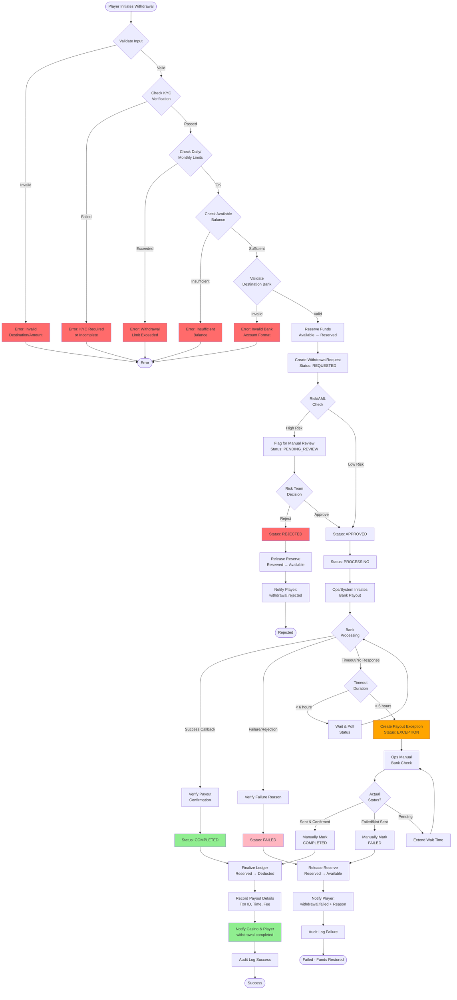

# Withdrawal Request Flow (Money Out)

## Overview
Handles player withdrawal requests from initiation through payout completion with fund reservation and multi-stage validation.

## Mermaid Diagram



## State Transitions

```
REQUESTED → PENDING_REVIEW (risk flagged)
PENDING_REVIEW → REJECTED (risk denial)
PENDING_REVIEW → APPROVED (risk cleared)
REQUESTED → APPROVED (auto-approved)
APPROVED → PROCESSING (payout initiated)
PROCESSING → COMPLETED (success)
PROCESSING → FAILED (bank rejection)
PROCESSING → EXCEPTION (timeout/unknown)
EXCEPTION → COMPLETED (manual confirmation)
EXCEPTION → FAILED (manual confirmation)
```

## Validation Stages

### 1. Input Validation

**Checks:**
- Amount > minimum (e.g., RM 20.00)
- Amount ≤ maximum per transaction (e.g., RM 50,000)
- Amount format: 2 decimal places, positive number
- Destination bank account: valid format per country
- Currency: supported by operator

**Exception Handling:**
- **Invalid Amount Format:** Return HTTP 400 with "Amount must be positive with 2 decimal places"
- **Below Minimum:** Return "Minimum withdrawal is RM 20.00"
- **Above Maximum:** Return "Maximum withdrawal is RM 50,000.00 per transaction"
- **Invalid Bank Account:** Return "Invalid bank account format. Expected format: 1234567890 (10-16 digits)"

---

### 2. KYC Verification

**Tiers:**
- **Tier 0 (Unverified):** Cannot withdraw
- **Tier 1 (Basic):** Max RM 500/day
- **Tier 2 (Verified):** Max RM 5,000/day
- **Tier 3 (Full KYC):** Max RM 50,000/day

**Checks:**
- KYC status = VERIFIED
- KYC documents not expired
- Name on bank account matches KYC name

**Exception Handling:**
- **No KYC:** Return "Please complete KYC verification to withdraw"
- **Pending KYC:** Return "KYC verification in progress, estimated completion: 24 hours"
- **KYC Expired:** Return "KYC documents expired, please re-verify"
- **Name Mismatch:** Flag for manual review, notify compliance

---

### 3. Limit Checks

**Types:**
- Daily withdrawal limit (per player)
- Monthly withdrawal limit
- Lifetime limit (anti-fraud)
- Velocity checks (frequency)

**Calculation:**
```
today_withdrawn = sum(withdrawals where
  player_id = X AND
  status = COMPLETED AND
  completed_at >= start_of_day
)

remaining_daily = daily_limit - today_withdrawn
```

**Exception Handling:**
- **Daily Limit Exceeded:** Return "Daily limit exceeded. Withdrawn: RM 4,500 / RM 5,000. Resets at midnight."
- **Too Frequent:** Return "Maximum 3 withdrawals per day. Please try again tomorrow."
- **Velocity Alert:** Flag for risk review (unusual pattern)

---

### 4. Balance Check

**Checks:**
- Available balance ≥ requested amount
- No pending withdrawals locking funds
- Account not suspended/frozen

**Calculation:**
```
available_balance = total_balance - reserved_funds - pending_bets
```

**Exception Handling:**
- **Insufficient Balance:** Return "Insufficient balance. Available: RM 450.00, Requested: RM 500.00"
- **Funds Reserved:** Return "Funds reserved for pending withdrawal. Available: RM 200.00"
- **Account Frozen:** Return "Account temporarily suspended. Contact support."

---

### 5. Destination Validation

**Checks:**
- Bank code exists in supported banks list
- Account number format valid (per bank rules)
- Not in blacklist (fraud prevention)
- Ownership verification (if first time)

**Validation Examples (Malaysia):**
```javascript
// Maybank: 14 digits
/^\d{14}$/

// CIMB: 10 digits
/^\d{10}$/

// Public Bank: 10 digits
/^\d{10}$/
```

**Exception Handling:**
- **Unsupported Bank:** Return "Bank not supported. Supported banks: Maybank, CIMB, Public Bank, ..."
- **Invalid Format:** Return "Invalid account number for Maybank. Expected: 14 digits"
- **Blacklisted:** Return "This account cannot be used. Contact support."
- **New Destination (First Time):** Require additional verification (send OTP, micro-deposit test)

---

## Risk/AML Checks

### Automatic Flags (High Risk)

**Trigger Conditions:**
1. **Large Amount:** Single withdrawal > RM 10,000
2. **Rapid Withdrawals:** Multiple withdrawals within 1 hour
3. **New Account:** Player registered < 7 days ago
4. **First Withdrawal:** Player's first ever withdrawal
5. **Pattern Change:** Withdrawal 10x larger than average
6. **Suspicious Behavior:** Multiple failed login attempts before withdrawal
7. **Geo-location Mismatch:** IP country ≠ bank country
8. **Velocity Spike:** 5+ withdrawals in 24 hours

**Automated Actions:**
- Status → PENDING_REVIEW
- Notify risk team (email + dashboard alert)
- Hold funds in reserved state
- SLA: Review within 2 hours

### Manual Review Process

**Risk Team Dashboard:**
- Player profile & history
- Recent deposits & withdrawals
- Gaming activity (win/loss ratio)
- Device fingerprint & IP history
- KYC documents

**Decision Options:**
1. **Approve:** Continue to payout
2. **Reject:** Release funds, notify player with reason
3. **Request More Info:** Contact player for verification
4. **Escalate:** Refer to compliance officer

**Audit Trail:**
- Reviewer name & ID
- Review timestamp
- Decision & reason
- Supporting evidence

---

## Fund Reservation Logic

### Reserve Funds (At Request Creation)

```sql
-- Atomic operation
BEGIN TRANSACTION;

UPDATE player_balances
SET available = available - :amount,
    reserved = reserved + :amount
WHERE player_id = :player_id
  AND available >= :amount
  AND updated_at = :expected_version; -- Optimistic locking

INSERT INTO withdrawal_requests (player_id, amount, status, reserved_at)
VALUES (:player_id, :amount, 'REQUESTED', NOW());

COMMIT;
```

**Exception Handling:**
- **Concurrent Withdrawal:** If balance check passes but reserve fails (race condition), return "Another withdrawal in progress, please try again"
- **Database Lock Timeout:** Retry up to 3 times with exponential backoff
- **Transaction Rollback:** If any step fails, entire transaction rolls back (no partial state)

### Release Funds (On Failure/Rejection)

```sql
BEGIN TRANSACTION;

UPDATE player_balances
SET available = available + :amount,
    reserved = reserved - :amount
WHERE player_id = :player_id;

UPDATE withdrawal_requests
SET status = 'FAILED',
    released_at = NOW(),
    failure_reason = :reason
WHERE id = :request_id;

COMMIT;
```

**Critical:** Must be idempotent (safe to retry)

---

## Payout Execution

### Operator-Initiated Payout (Manual Banking)

**Since bank won't help with automation:**

1. **Ops Dashboard View:**
   - List of APPROVED withdrawals
   - Batch export to CSV/Excel
   - Columns: Player Name, Bank Account, Amount, Reference ID

2. **Ops Action:**
   - Login to bank portal
   - Create bulk transfer file or manual transfers
   - Upload/execute transfers
   - Record transaction IDs from bank confirmation

3. **System Update:**
   - Ops enters bank transaction ID for each withdrawal
   - System marks as PROCESSING
   - System monitors for confirmation (bank statement import or manual confirmation)

### Payout Confirmation

**Confirmation Sources:**
1. **Bank Statement Import:** Automated daily import, match by transaction ID
2. **Manual Ops Entry:** Ops marks as completed with proof (screenshot, reference number)
3. **Player Confirmation:** Player confirms receipt (optional, for disputes)

**Verification:**
- Cross-check transaction ID from bank statement
- Verify amount matches exactly
- Verify destination account matches
- Check timestamp within expected window

---

## Exception Handling

### 1. **Payout Timeout (No Confirmation)**

**Scenario:** WithdrawalRequest stuck in PROCESSING > 6 hours

**Detection:**
```sql
SELECT * FROM withdrawal_requests
WHERE status = 'PROCESSING'
  AND updated_at < NOW() - INTERVAL '6 hours';
```

**Handling:**
- Create PayoutException record
- Move to exception queue (ops dashboard)
- Notify ops team
- SLA: Resolve within 4 hours

**Ops Action:**
- Check bank portal for transfer status
- If sent & confirmed → Mark COMPLETED
- If failed/rejected → Mark FAILED + release reserve
- If still pending → Extend wait, check again in 2 hours

---

### 2. **Bank Rejection (Insufficient Funds, Invalid Account)**

**Scenario:** Bank returns error: "Invalid account number"

**Detection:** Webhook/callback from bank or manual ops entry

**Handling:**
- Status → FAILED
- Record failure_reason: "Bank rejected: Invalid account"
- Release reserved funds immediately
- Notify player with actionable message

**Player Notification:**
"Your withdrawal of RM 500.00 failed. Reason: Invalid bank account number. Please update your bank details and try again. Funds have been returned to your balance."

**Follow-up:**
- Flag destination bank account as invalid
- Prevent future withdrawals to same account
- Suggest player verify bank details

---

### 3. **Partial Payout (Wrong Amount Sent)**

**Scenario:** Ops accidentally sent RM 450.00 instead of RM 500.00

**Detection:** Manual discovery or player complaint

**Handling:**
- Flag as EXCEPTION_PARTIAL
- Calculate shortfall: RM 50.00
- Options:
  1. **Create Corrective Withdrawal:** New WithdrawalRequest for RM 50.00
  2. **Credit to Balance:** Return RM 50.00 to player balance + apology bonus
  3. **Manual Payout:** Ops sends additional RM 50.00 separately

**Audit:**
- Log error in staff audit trail
- Alert finance team (discrepancy in ledger)
- Implement safeguard: Require dual-entry for amounts > RM 5,000

---

### 4. **Duplicate Payout (Sent Twice)**

**Scenario:** Ops sent payout twice due to system error

**Detection:** Reconciliation finds 2 bank debits for 1 WithdrawalRequest

**Handling:**
- Mark as EXCEPTION_DUPLICATE
- Calculate overpayment: Original amount
- Options:
  1. **Request Refund from Player:** Contact player, request return (may damage trust)
  2. **Absorb Loss:** Operator eats the cost (goodwill)
  3. **Deduct from Future Wins:** Debit player balance (controversial)

**Prevention:**
- Implement idempotency key for payout operations
- Ops dashboard shows warning if withdrawal already processed
- Require confirmation before duplicate submission

---

### 5. **Player Disputes Payout**

**Scenario:** Player claims they never received RM 500.00

**Detection:** Player opens support ticket

**Handling:**
- Retrieve WithdrawalRequest (status: COMPLETED)
- Provide proof:
  - Bank transaction ID
  - Bank statement screenshot
  - Timestamp of payout
  - Destination bank account (last 4 digits)

**Resolution:**
- If proof exists → Close ticket (player error or bank delay)
- If no proof → Investigate as potential ops error
- If bank sent to wrong account → Escalate to bank for reversal

---

## Monitoring & Alerts

### Real-Time Alerts

**Critical (Immediate):**
- Withdrawal stuck in PROCESSING > 6 hours
- Daily payout total > RM 100,000 (unusual)
- Multiple FAILED withdrawals (> 10 in 1 hour)
- Reserved funds > RM 500,000 (liquidity risk)

**Warning (within 1 hour):**
- Withdrawal pending risk review > 2 hours
- Ops hasn't confirmed payout > 4 hours after PROCESSING
- Player complaints about missing payout

### Daily Reconciliation

**Checks:**
1. **Bank Debits = Completed Withdrawals**
   - Sum of bank statement debits
   - Sum of WithdrawalRequest (status: COMPLETED)
   - Variance should be 0

2. **Reserved Funds Balance**
   - Sum of reserved in player_balances table
   - Sum of WithdrawalRequest (status: PROCESSING, REQUESTED, PENDING_REVIEW)
   - Should match exactly

3. **Exception Queue Size**
   - Count of unresolved exceptions
   - Alert if > 20 exceptions pending

**Report:**
- Email to finance team every morning
- Flag discrepancies for immediate investigation

---

## Withdrawal Limits Configuration

```json
{
  "global_limits": {
    "min_withdrawal": 20.00,
    "max_withdrawal_per_transaction": 50000.00,
    "max_withdrawals_per_day": 3
  },
  "kyc_tier_limits": {
    "tier_1_daily": 500.00,
    "tier_2_daily": 5000.00,
    "tier_3_daily": 50000.00
  },
  "velocity_limits": {
    "max_hourly_count": 1,
    "max_daily_count": 3,
    "max_weekly_amount": 20000.00
  },
  "auto_approval_threshold": 5000.00,
  "risk_review_threshold": 10000.00
}
```
