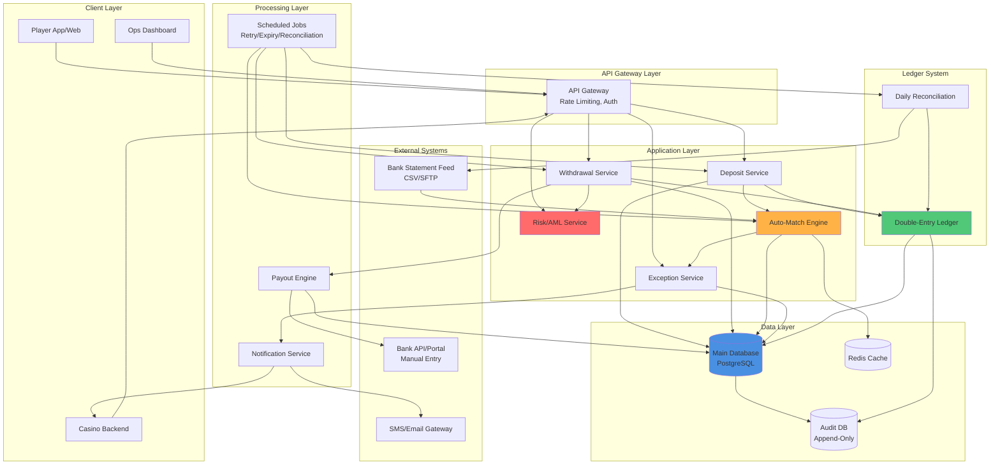
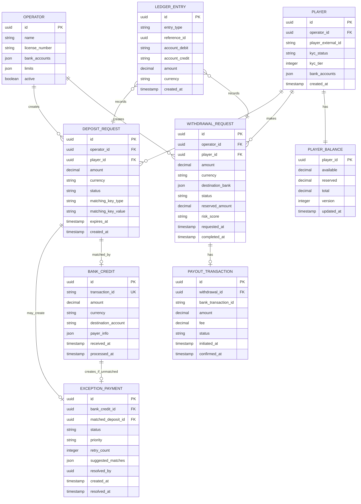
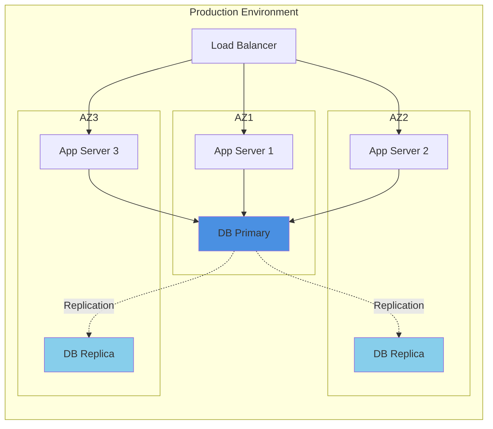

# Casino Banking System - Architecture Overview

## System Architecture Diagram

## Component Responsibilities

### 1. API Gateway
- **Purpose:** Single entry point, security boundary
- **Functions:**
  - JWT authentication & authorization
  - Rate limiting (per player/operator)
  - Request validation
  - API versioning
  - Logging & monitoring
- **Tech Stack:** Kong, AWS API Gateway, or Nginx

---

### 2. Deposit Service
- **Endpoints:**
  - `POST /deposits` - Create deposit request
  - `GET /deposits/:id` - Get deposit status
  - `GET /deposits` - List player deposits
- **Responsibilities:**
  - Input validation
  - Generate matching keys (VA/unique amount)
  - Create DepositRequest records
  - Trigger match engine on bank credit events
  - Handle webhooks from banks (if available)

---

### 3. Withdrawal Service
- **Endpoints:**
  - `POST /withdrawals` - Create withdrawal request
  - `GET /withdrawals/:id` - Get withdrawal status
  - `GET /withdrawals` - List player withdrawals
  - `POST /withdrawals/:id/cancel` - Cancel pending withdrawal
- **Responsibilities:**
  - Balance & limit checks
  - Fund reservation
  - Trigger risk checks
  - Interface with payout engine
  - Handle bank callbacks

---

### 4. Auto-Match Engine
- **Core Function:** Link BankCredit → DepositRequest
- **Matching Strategies:**
  1. Virtual Account match
  2. Unique amount match
  3. Payer fingerprint match
- **Performance:**
  - Cache frequently accessed deposit requests (Redis)
  - Batch processing for high volume
  - Async processing via message queue
- **Error Handling:**
  - Retry logic with exponential backoff
  - Dead letter queue for failed matches
  - Circuit breaker for downstream dependencies

---

### 5. Exception Service
- **Endpoints:**
  - `GET /exceptions` - List unmatched payments
  - `POST /exceptions/:id/match` - Manual match
  - `POST /exceptions/:id/refund` - Initiate refund
  - `POST /exceptions/:id/reject` - Reject payment
- **Responsibilities:**
  - Manage exception queue
  - Auto-retry scheduling
  - Staff action logging
  - Exception reporting & analytics

---

### 6. Risk/AML Service
- **Functions:**
  - Rule-based risk scoring
  - Pattern detection (velocity, amount spikes)
  - Blacklist checking
  - KYC verification status
  - Manual review workflow
- **Integration Points:**
  - Called before withdrawal approval
  - Real-time scoring during request creation
  - Async background screening
- **Third-party Integration:**
  - AML screening services (e.g., Chainalysis, ComplyAdvantage)
  - Fraud detection ML models

---

### 7. Payout Engine
- **Modes:**
  - **Manual Mode:** Generate CSV for ops to upload to bank
  - **Semi-Automated:** API integration with bank (if available later)
  - **Fully Automated:** Direct bank API (future)
- **Functions:**
  - Batch payout file generation
  - Payout status tracking
  - Confirmation matching (bank statement → withdrawal request)
  - Retry failed payouts

---

### 8. Ledger System
- **Architecture:** Double-entry accounting
- **Accounts:**
  - Player Balances (Available, Reserved)
  - Suspense Account (unmatched deposits)
  - Operator Revenue
  - Payout Pending
  - Refund Pending
- **Operations:**
  - Deposit: `Suspense → Player Available`
  - Withdrawal Reserve: `Player Available → Player Reserved`
  - Withdrawal Complete: `Player Reserved → Payout Pending`
  - Withdrawal Failed: `Player Reserved → Player Available`
- **Guarantees:**
  - Atomic transactions (all-or-nothing)
  - Idempotency (duplicate-safe)
  - Immutable audit trail

---

### 9. Scheduled Jobs

| Job | Frequency | Purpose |
|-----|-----------|---------|
| Expiry Check | Every 5 min | Mark expired deposit requests |
| Auto-Retry Match | Every 15 min | Re-run match engine for exceptions |
| Payout Timeout Check | Every 30 min | Flag stuck withdrawals |
| Daily Reconciliation | Every 24 hours | Balance ledger vs bank statements |
| Exception SLA Monitor | Hourly | Alert for overdue exceptions |
| Cleanup Old Records | Weekly | Archive completed transactions > 90 days |

---

### 10. Notification Service
- **Channels:**
  - Webhooks to casino backend
  - SMS to players (OTP, confirmations)
  - Email (receipts, alerts)
  - Push notifications (mobile app)
- **Events:**
  - Deposit completed
  - Withdrawal completed/failed
  - Exception created
  - Risk review required
- **Reliability:**
  - Message queue (RabbitMQ, Kafka)
  - Retry failed notifications
  - Delivery status tracking

---

## Data Models

### Core Entities

---

## Security Considerations

### 1. Authentication & Authorization
- **Player Authentication:** JWT tokens, refresh tokens
- **Ops Staff:** SSO + MFA (mandatory)
- **Casino Backend:** API keys with IP whitelist
- **Bank Webhooks:** Signature verification (HMAC)

### 2. Data Protection
- **Encryption at Rest:** Database encryption (AES-256)
- **Encryption in Transit:** TLS 1.3 for all APIs
- **PII Masking:** Mask bank account numbers in logs (show last 4 digits)
- **Sensitive Fields:** Encrypt player bank accounts, KYC documents

### 3. Fraud Prevention
- **Rate Limiting:** Max 5 withdrawal requests per player per hour
- **IP Geofencing:** Alert if withdrawal request from different country
- **Device Fingerprinting:** Track device IDs, alert on new devices
- **Behavioral Analysis:** Flag unusual patterns (e.g., deposit + immediate withdrawal)

### 4. Compliance (AML/KYC)
- **Transaction Monitoring:** Alert on transactions > threshold
- **Suspicious Activity Reports (SAR):** Auto-generate for review
- **Audit Trail:** Immutable logs of all financial transactions
- **Data Retention:** 7 years for regulatory compliance

---

## Scalability & Performance

### 1. Database Optimization
- **Read Replicas:** Separate read traffic from writes
- **Partitioning:** Partition by operator_id or date
- **Indexes:**
  - `deposit_requests(status, expires_at)` for expiry checks
  - `bank_credits(transaction_id)` for idempotency
  - `exception_payments(status, created_at)` for queues

### 2. Caching Strategy
- **Cache Hot Data:**
  - Player balances (5 min TTL)
  - Active deposit requests (10 min TTL)
  - Operator limits & configs (1 hour TTL)
- **Cache Invalidation:**
  - Write-through on balance updates
  - Event-based invalidation on status changes

### 3. Async Processing
- **Message Queue:** Use Kafka/RabbitMQ for:
  - Bank credit event ingestion
  - Auto-match processing
  - Notification delivery
- **Benefits:**
  - Decouple bank feed from matching logic
  - Buffer traffic spikes
  - Retry failed operations

### 4. Horizontal Scaling
- **Stateless Services:** All application services are stateless
- **Load Balancing:** Distribute traffic across multiple instances
- **Database Connection Pooling:** PgBouncer for PostgreSQL

---

## Disaster Recovery

### 1. Backup Strategy
- **Database Backups:**
  - Continuous WAL archiving (PostgreSQL)
  - Daily full backups
  - Retention: 30 days
- **Audit Log Backups:**
  - Replicated to separate storage
  - Immutable (append-only)
  - Retention: 7 years

### 2. High Availability
- **Database:** Master-replica setup with auto-failover
- **Application:** Multi-AZ deployment
- **Cache:** Redis Sentinel for automatic failover

### 3. Incident Response
- **Runbooks:** Documented procedures for common failures
- **On-Call Rotation:** 24/7 engineering support
- **Rollback Plan:** Automated rollback for failed deployments

---

## Monitoring & Observability

### 1. Metrics (Prometheus/Grafana)
- **Business Metrics:**
  - Deposit success rate
  - Auto-match rate
  - Average exception resolution time
  - Withdrawal completion rate
- **System Metrics:**
  - API latency (p50, p95, p99)
  - Error rate per endpoint
  - Database connection pool usage
  - Cache hit/miss rate

### 2. Logging (ELK Stack)
- **Structured Logs:** JSON format with trace IDs
- **Log Levels:**
  - ERROR: System failures, exceptions
  - WARN: Business rule violations, retries
  - INFO: State transitions, API calls
  - DEBUG: Detailed debug info (disabled in prod)

### 3. Alerting (PagerDuty/Opsgenie)
- **Critical Alerts:**
  - Database down
  - API error rate > 5%
  - Reconciliation mismatch > RM 1,000
- **Warning Alerts:**
  - Exception queue > 50 items
  - Withdrawal SLA breach
  - Cache miss rate > 30%

---

## Deployment Architecture

**Deployment Strategy:**
- **Blue-Green Deployment:** Zero-downtime releases
- **Canary Releases:** Gradual rollout (10% → 50% → 100%)
- **Feature Flags:** Toggle features without deployment

---

## Cost Optimization

1. **Database:** Use read replicas only for heavy reporting queries
2. **Caching:** Reduce database load by 60-70%
3. **Archive Old Data:** Move transactions > 90 days to cold storage
4. **Right-size Instances:** Monitor usage, scale down underutilized services
5. **Spot Instances:** Use for non-critical batch jobs (reconciliation)
