# Daily Reconciliation Flow

## Overview
Ensures ledger balances match bank statements and identifies discrepancies for investigation.

## Mermaid Diagram

```mermaid
flowchart TD
    Start([Daily Reconciliation<br/>Scheduled Job]) --> FetchBankStatement[Fetch Bank Statement<br/>Previous 24 Hours]

    FetchBankStatement --> ParseStatement[Parse Statement<br/>Extract Credits & Debits]

    ParseStatement --> ReconcileCredits{Reconcile<br/>Bank Credits}

    %% Credits Reconciliation
    ReconcileCredits --> GetCompletedDeposits[Get Completed Deposits<br/>Last 24 Hours]
    GetCompletedDeposits --> MatchCredits[Match Each Credit<br/>to DepositRequest]

    MatchCredits --> CreditResult{All Credits<br/>Matched?}

    CreditResult -->|Yes| ReconcileDebits
    CreditResult -->|No| UnmatchedCredits[Flag Unmatched Credits]
    UnmatchedCredits --> CheckExceptions{Already in<br/>Exception Queue?}
    CheckExceptions -->|Yes| LogDuplicate[Log - Already Handled]
    CheckExceptions -->|No| CreateMissingException[Create Missing<br/>ExceptionPayment]
    CreateMissingException --> AlertOps1[Alert Ops:<br/>Missing Exception]
    AlertOps1 --> ReconcileDebits
    LogDuplicate --> ReconcileDebits

    %% Debits Reconciliation
    ReconcileDebits{Reconcile<br/>Bank Debits} --> GetCompletedWithdrawals[Get Completed Withdrawals<br/>Last 24 Hours]
    GetCompletedWithdrawals --> MatchDebits[Match Each Debit<br/>to WithdrawalRequest]

    MatchDebits --> DebitResult{All Debits<br/>Matched?}

    DebitResult -->|Yes| CheckLedger
    DebitResult -->|No| UnmatchedDebits[Flag Unmatched Debits]
    UnmatchedDebits --> InvestigateDebits{Type of<br/>Mismatch?}

    InvestigateDebits -->|Extra Debit| UnknownPayout[Unknown Payout<br/>Not in System]
    UnknownPayout --> AlertFinance1[Alert Finance Team:<br/>Unauthorized Payout?]
    AlertFinance1 --> CheckLedger

    InvestigateDebits -->|Missing Debit| MissingConfirm[Withdrawal Marked COMPLETED<br/>But No Bank Debit]
    MissingConfirm --> FlagWithdrawal[Flag Withdrawal<br/>for Investigation]
    FlagWithdrawal --> AlertFinance2[Alert Finance Team:<br/>Possible Error]
    AlertFinance2 --> CheckLedger

    %% Ledger Reconciliation
    CheckLedger{Reconcile<br/>Ledger Balances} --> CalculateExpected[Calculate Expected Balances:<br/>Opening + Credits - Debits]
    CalculateExpected --> GetActualBalances[Get Actual Balances:<br/>Sum of Player Balances]
    GetActualBalances --> CompareBalances{Balances<br/>Match?}

    CompareBalances -->|Yes| CheckReserved
    CompareBalances -->|No| BalanceVariance[Calculate Variance]
    BalanceVariance --> CheckTolerance{Variance ><br/>Tolerance?}
    CheckTolerance -->|Within Tolerance| LogMinorVar[Log Minor Variance<br/>< RM 1.00]
    CheckTolerance -->|Exceeds| CriticalAlert[CRITICAL ALERT:<br/>Ledger Mismatch]
    CriticalAlert --> LockSystem[Lock Withdrawals<br/>Until Resolved]
    LockSystem --> EscalateFinance[Escalate to Finance<br/>& Engineering]
    EscalateFinance --> CheckReserved
    LogMinorVar --> CheckReserved

    %% Reserved Funds Check
    CheckReserved{Check Reserved<br/>Funds} --> GetPendingWD[Get Pending Withdrawals<br/>REQUESTED + PROCESSING]
    GetPendingWD --> SumReserved[Sum Reserved Amounts]
    SumReserved --> CompareReserved{Reserved Funds<br/>Match?}

    CompareReserved -->|Yes| CheckSuspense
    CompareReserved -->|No| ReservedMismatch[Flag Reserved<br/>Mismatch]
    ReservedMismatch --> AlertOps2[Alert Ops:<br/>Reserved Variance]
    AlertOps2 --> CheckSuspense

    %% Suspense Account Check
    CheckSuspense{Check Suspense<br/>Account} --> GetUnmatched[Get Unmatched<br/>ExceptionPayments]
    GetUnmatched --> SumSuspense[Sum Suspense Balance]
    SumSuspense --> CompareSuspense{Suspense<br/>Matches?}

    CompareSuspense -->|Yes| GenerateReport
    CompareSuspense -->|No| SuspenseMismatch[Flag Suspense<br/>Mismatch]
    SuspenseMismatch --> AlertOps3[Alert Ops:<br/>Suspense Variance]
    AlertOps3 --> GenerateReport

    %% Final Report
    GenerateReport[Generate Reconciliation<br/>Report] --> EmailReport[Email Report to:<br/>Finance, Ops, Management]
    EmailReport --> UpdateDashboard[Update Reconciliation<br/>Dashboard]
    UpdateDashboard --> ArchiveReport[Archive Report<br/>for Audit]
    ArchiveReport --> End([Reconciliation Complete])

    style CompareBalances fill:#90EE90
    style CreditResult fill:#90EE90
    style DebitResult fill:#90EE90
    style CriticalAlert fill:#FF6B6B
    style AlertFinance1 fill:#FF6B6B
    style AlertFinance2 fill:#FF6B6B
    style UnmatchedCredits fill:#FFA500
    style UnmatchedDebits fill:#FFA500
```



## Reconciliation Components

### 1. Bank Statement Import

**Sources:**
- **SFTP/FTP:** Daily statement file upload
- **API:** Bank API (if available)
- **Manual Upload:** Ops uploads CSV/Excel

**Format Parsing:**
```json
{
  "transaction_id": "BNK20260201001",
  "type": "CREDIT",
  "amount": 100.01,
  "currency": "MYR",
  "account": "1234567890",
  "payer_name": "JOHN DOE",
  "payer_account": "9876543210",
  "timestamp": "2026-02-01T10:30:00Z",
  "balance_after": 50000.00
}
```

**Validation:**
- Check file integrity (checksum)
- Verify date range matches expected
- Ensure no duplicate files processed

---

### 2. Credits Reconciliation (Deposits)

**Process:**
```sql
-- Get all bank credits from statement
SELECT * FROM bank_statement_credits
WHERE date = '2026-02-01';

-- Get all completed deposits
SELECT * FROM deposit_requests
WHERE status = 'COMPLETED'
  AND completed_at >= '2026-02-01 00:00:00'
  AND completed_at < '2026-02-02 00:00:00';

-- Match by bank_transaction_id
-- Flag unmatched credits
```

**Exception Scenarios:**

**A) Unmatched Bank Credit (Not in System)**
- **Possible Causes:**
  - Player paid but system didn't detect
  - Manual bank entry not recorded
  - Bank statement contains non-gaming credit
- **Handling:**
  - Check if ExceptionPayment already exists
  - If not, create new exception
  - Alert ops for review

**B) Matched Deposit But No Bank Credit**
- **Possible Causes:**
  - Deposit marked completed incorrectly
  - Bank statement missing transaction
  - Timing issue (credit posted next day)
- **Handling:**
  - Flag for investigation
  - Check if amount is in next day's statement
  - If not found in 48 hours → Critical alert

---

### 3. Debits Reconciliation (Withdrawals)

**Process:**
```sql
-- Get all bank debits from statement
SELECT * FROM bank_statement_debits
WHERE date = '2026-02-01';

-- Get all completed withdrawals
SELECT * FROM withdrawal_requests
WHERE status = 'COMPLETED'
  AND completed_at >= '2026-02-01 00:00:00'
  AND completed_at < '2026-02-02 00:00:00';

-- Match by bank_transaction_id
-- Flag unmatched debits
```

**Exception Scenarios:**

**A) Unmatched Bank Debit (Not in System)**
- **Possible Causes:**
  - Unauthorized withdrawal (fraud!)
  - Manual bank transfer not recorded
  - Bank fee/charge
- **Handling:**
  - **CRITICAL ALERT** (potential fraud)
  - Lock withdrawals immediately
  - Investigate source of debit
  - Check if legitimate (bank fees, taxes, etc.)

**B) Completed Withdrawal But No Bank Debit**
- **Possible Causes:**
  - Ops marked completed prematurely
  - Bank hasn't processed yet (delay)
  - System error (double-counting)
- **Handling:**
  - Check bank portal for transfer status
  - If not sent → Revert status to PROCESSING
  - If sent but not posted → Wait 48 hours
  - If confirmed error → Release reserved funds + alert

---

### 4. Ledger Balance Reconciliation

**Formula:**
```
Expected_Balance = Opening_Balance + Total_Credits - Total_Debits

Actual_Balance = SUM(player_balances.available + player_balances.reserved)

Variance = Expected_Balance - Actual_Balance
```

**Tolerance:**
- **Acceptable:** Variance ≤ RM 1.00 (rounding errors)
- **Warning:** RM 1.00 < Variance ≤ RM 100.00
- **Critical:** Variance > RM 100.00

**Critical Variance Actions:**
1. **Immediate:** Lock all withdrawals
2. **Alert:** Finance Director, CTO, Compliance Officer
3. **Investigate:**
   - Review all transactions for the day
   - Check for double-processing
   - Verify all ledger entries
4. **Resolve:** Identify root cause, correct entries
5. **Unlock:** Resume withdrawals after confirmation

---

### 5. Reserved Funds Reconciliation

**Check:**
```sql
-- Calculate expected reserved
SELECT SUM(amount)
FROM withdrawal_requests
WHERE status IN ('REQUESTED', 'PROCESSING', 'PENDING_REVIEW');

-- Get actual reserved
SELECT SUM(reserved)
FROM player_balances;

-- Should match exactly
```

**Mismatch Handling:**
- **Excess Reserved:** Player balance locked incorrectly
  - Identify orphaned reserves
  - Release if no active withdrawal
- **Insufficient Reserved:** Withdrawal not reserving properly
  - Check for transaction rollback failures
  - Fix affected withdrawals

---

### 6. Suspense Account Reconciliation

**Check:**
```sql
-- Sum all unmatched exception payments
SELECT SUM(amount)
FROM exception_payments
WHERE status = 'UNMATCHED';

-- Should match suspense_account.balance
```

**Mismatch Actions:**
- Review all exception creations for the day
- Check for manual matches not updating suspense
- Verify ledger entries for each exception

---

## Exception Handling

### 1. **Statement Import Failure**
**Exception:** Bank statement file not received by 9 AM

**Handling:**
- Retry SFTP connection every 30 min
- After 3 failures → Alert ops
- Ops manually downloads and uploads
- Log incident for SLA tracking

---

### 2. **Duplicate Statement Processing**
**Exception:** Same statement file processed twice

**Handling:**
- Check file hash before processing
- Store processed file hashes in database
- If duplicate detected → Skip processing
- Log warning

---

### 3. **Date Mismatch**
**Exception:** Statement date ≠ expected date

**Handling:**
- Validate date range in filename and content
- If mismatch → Reject file
- Alert ops to verify correct file
- Do not proceed with reconciliation

---

### 4. **Partial Statement (Missing Transactions)**
**Exception:** Bank statement total doesn't match expected

**Handling:**
- Compare statement ending balance with expected
- If mismatch > RM 1,000 → Flag as incomplete
- Contact bank for full statement
- Pause reconciliation until resolved

---

### 5. **Reconciliation Timeout**
**Exception:** Process takes > 1 hour

**Handling:**
- Check for database deadlocks
- Verify statement file size (too large?)
- Split processing into batches
- Alert engineering team

---

## Reconciliation Report

### Report Sections

**1. Summary**
```
Date: 2026-02-01
Status: ✅ PASS / ⚠️ WARNING / ❌ CRITICAL

Opening Balance: RM 1,000,000.00
Total Credits: RM 50,000.00
Total Debits: RM 30,000.00
Expected Balance: RM 1,020,000.00
Actual Balance: RM 1,020,000.00
Variance: RM 0.00
```

**2. Credits Reconciliation**
```
Bank Credits Count: 120
Matched Deposits: 118
Unmatched Credits: 2 (flagged as exceptions)
Missing Credits: 0
```

**3. Debits Reconciliation**
```
Bank Debits Count: 45
Matched Withdrawals: 45
Unmatched Debits: 0
Missing Debits: 0
```

**4. Reserved Funds**
```
Expected Reserved: RM 15,000.00
Actual Reserved: RM 15,000.00
Pending Withdrawals: 30
```

**5. Suspense Account**
```
Expected Suspense: RM 5,000.00
Actual Suspense: RM 5,000.00
Unmatched Exceptions: 10
```

**6. Exceptions & Alerts**
```
⚠️ 2 unmatched bank credits flagged for review
✅ No critical variances detected
✅ All withdrawals accounted for
```

---

## Automated Remediation

### Auto-Fix Scenarios

**1. Minor Rounding Errors (< RM 1.00)**
- **Action:** Create ledger adjustment entry
- **Account:** "Rounding Adjustments"
- **Notify:** Finance team (summary only)

**2. Timing Differences (Cross-Day Transactions)**
- **Action:** Mark as "Under Review - Next Day Expected"
- **Follow-up:** Check next day's reconciliation
- **Auto-clear:** If found in next statement

**3. Bank Fees (Recognized Pattern)**
- **Action:** Auto-classify as "Bank Fees"
- **Account:** "Operating Expenses"
- **Verify:** Monthly total matches expected fees

---

## SLA & Monitoring

**Reconciliation SLA:**
- **Start Time:** 6:00 AM (after bank statement available)
- **Completion Target:** 9:00 AM
- **Max Duration:** 3 hours

**Alert Thresholds:**
- **Warning:** Process time > 1 hour
- **Critical:** Process time > 2 hours
- **Escalation:** Process time > 3 hours

**Daily Checklist:**
- [ ] Bank statement received
- [ ] All credits reconciled
- [ ] All debits reconciled
- [ ] Ledger balanced
- [ ] Reserved funds correct
- [ ] Suspense account balanced
- [ ] Report generated & emailed
- [ ] Dashboard updated

---

## Audit Trail

Every reconciliation creates audit records:

```json
{
  "reconciliation_id": "RECON_20260201",
  "date": "2026-02-01",
  "started_at": "2026-02-01T06:00:00Z",
  "completed_at": "2026-02-01T07:15:00Z",
  "duration_minutes": 75,
  "status": "PASS",
  "bank_statement_file": "statement_20260201.csv",
  "total_credits": 50000.00,
  "total_debits": 30000.00,
  "variance": 0.00,
  "unmatched_credits": 2,
  "unmatched_debits": 0,
  "exceptions_created": 2,
  "performed_by": "system_scheduler",
  "reviewed_by": "finance_ops_001"
}
```

**Retention:** 7 years (compliance)
